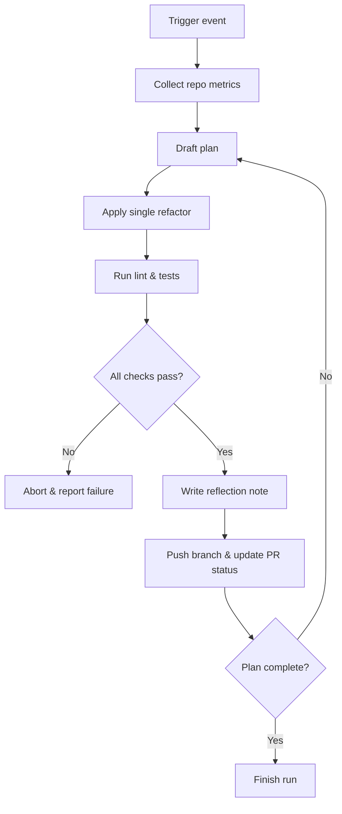

# Copilot Refactor Agent

A lightweight automation that keeps FrameForge modular by continuously inspecting diffs, extracting reusable code, and summarising its reasoning so humans can vet the work quickly.

---

## 1. Responsibilities

- **Plan**: Analyse the current branch for monolithic hotspots and generate a short refactor checklist (maximum five steps).
- **Execute**: Apply one focused change per cycle using the repository conventions (React + Vite, hooks, utility modules).
- **Self-Review**: Re-read the diff, ensure lint/tests are clean, and confirm the change aligns with the plan.
- **Reflect**: Persist a short note describing why the change reduces coupling, any trade-offs, and follow-up items.
- **Report**: Post the reflection summary back to the pull request or commit status for review.

## 2. Triggering the Agent

| Trigger | Description |
| --- | --- |
| Pull request comment (`/copilot-refactor`) | Maintainers can request on-demand cleanup. |
| Scheduled run (nightly) | Keeps long-lived feature branches from drifting into monolith territory. |
| Push to branches matching `feature/**` | Gives immediate feedback while the branch is still small. |

## 3. Metrics the Agent Tracks

- File length, number of exports, and layer mixing (UI vs state vs utilities).
- Dependency graph cycles and large fan-in/fan-out edges (via `dependency-cruiser`).
- ESLint warnings, test failures, and existing TODO markers.
- Trends for these metrics between runs (stored as JSON artefacts in GitHub Actions).

## 4. Chain-of-Thought (CoT) & Chain-of-Verification (CoVe)

Each run produces:

- **CoT trace** – a timestamped sequence describing what the agent observed, how it interpreted the evidence, and why it chose the next action. Stored under `.copilot/plans/<branch>.md`.
- **CoVe ledger** – verification checkpoints pairing each action with measurable evidence (lint, tests, file metrics, etc.). Stored alongside the CoT trace so reviewers can follow the logic from observation → action → validation.

These artefacts keep reasoning auditable without disclosing raw model prompts.

## 5. High-Level Flow

## 6. Local Development Workflow

1. Ensure Node ≥ 20.19 with `corepack enable` and the repo's `package.json` installed.
2. Run `npm install` to pull the tooling set (ESLint, dependency-cruiser, execa).
3. Execute `npm run lint` and `npm run test` (when a test script exists) before committing agent changes.
4. Test the agent script locally via `node scripts/refactor-agent.js --dry-run`.
5. Use `--apply` when you want the agent to emit JSON artefacts under `.copilot/reports/`.

## 7. Extensibility Hooks

- Add new heuristics by extending `calculateHotspots` in the script.
- Extend `analyzeDependencies` or tweak `depcruise.config.cjs` to enforce custom layering rules.
- Connect to external analysis services by inserting adapters into the `collectMetrics` step.
- Integrate with other bots by exposing a REST endpoint or using GitHub Checks API.

## 8. Next Steps

1. Tune hotspot thresholds (`--hotspot-threshold`) to match team standards.
2. Register the GitHub App credentials (PAT or GitHub App installation) in the repository secrets.
3. Enable the provided workflow and iterate on dependency-cruiser rules until they match architectural boundaries.
4. Add unit tests around the helper functions inside the agent script to keep behaviour predictable.
